# Технологическая (проектно-технологическая) практика
## 1. Hand Lettering
### Композиция в форме круга 
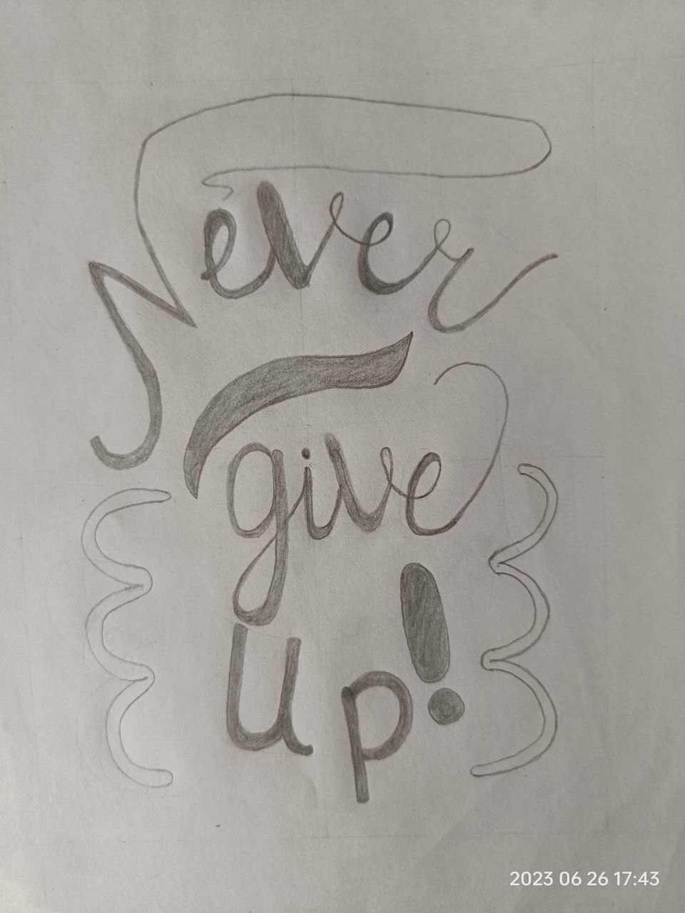
### Композиция в форме прямоугольника 
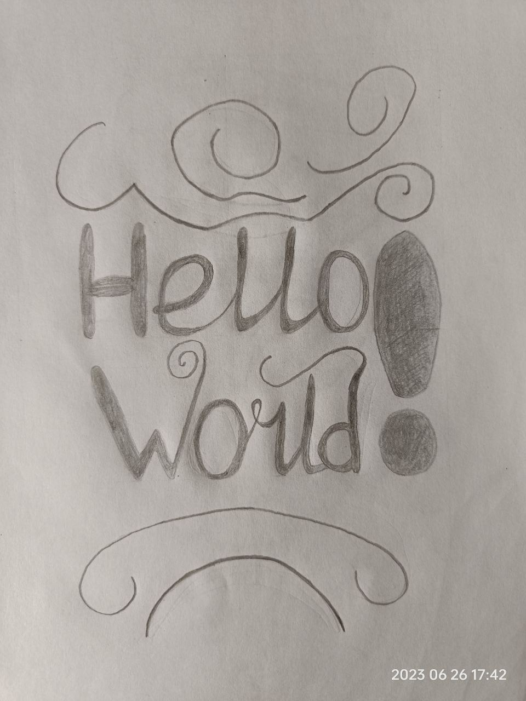
### Композиция в форме треугольника 
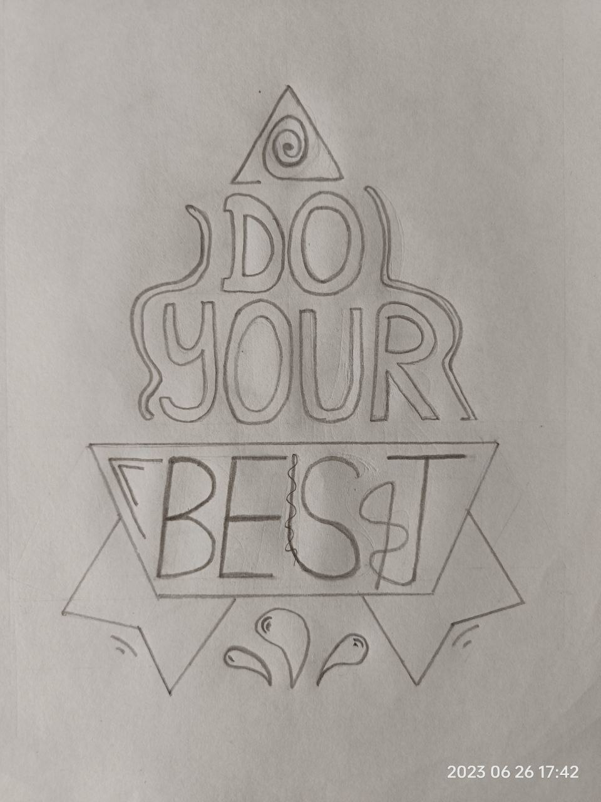
### Инициалы в стиле зентангл с геометрическим и растительным орнаментом
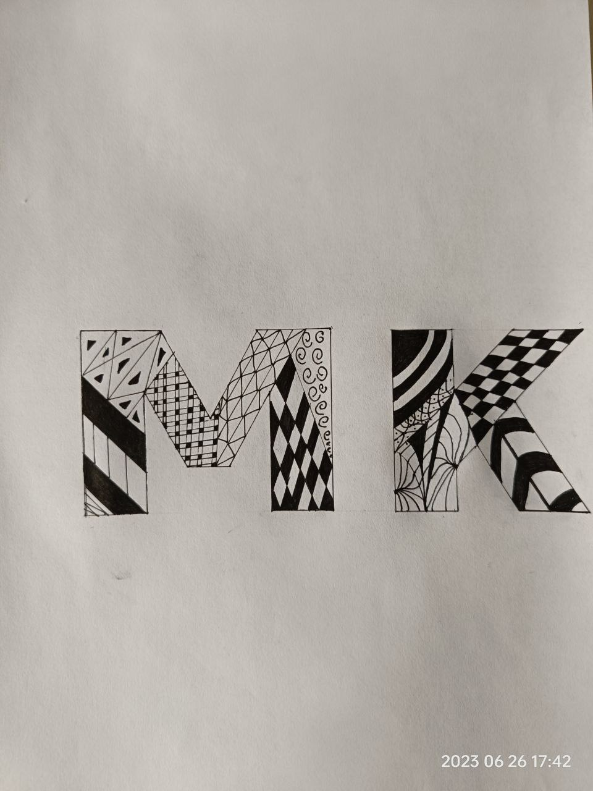
## 2. Chalk_Lettering
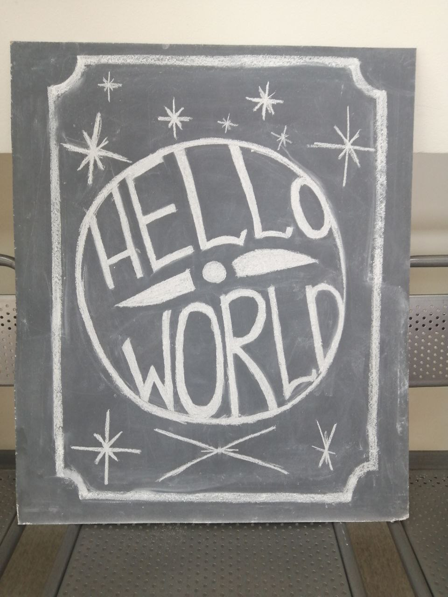

## 3. Викторианский_леттеринг
### Алфавит
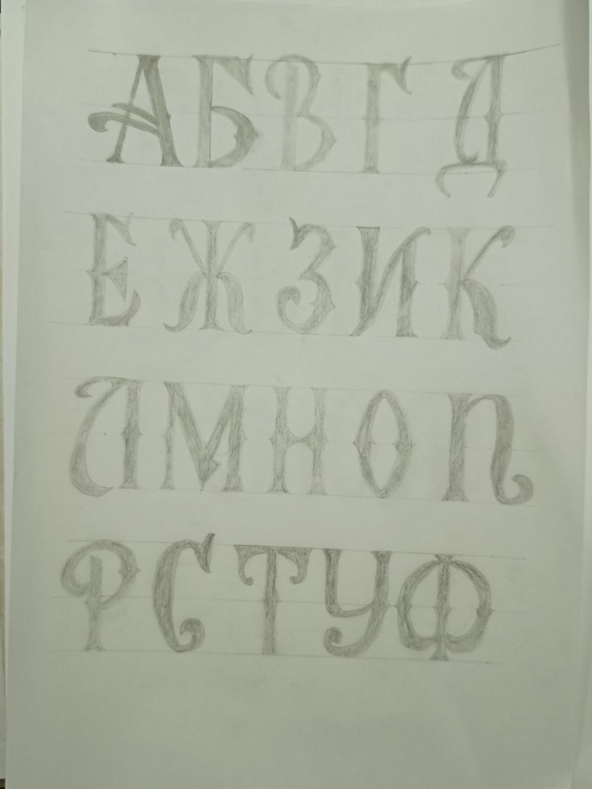
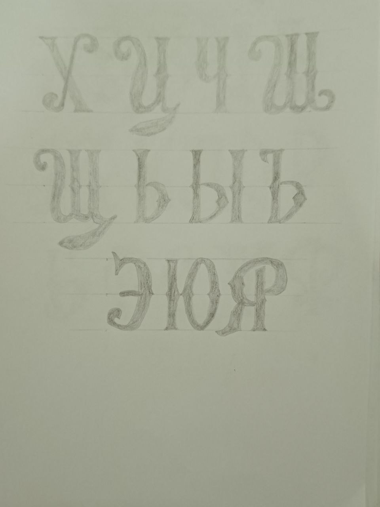
### Вариации букв алфавита

### Слова
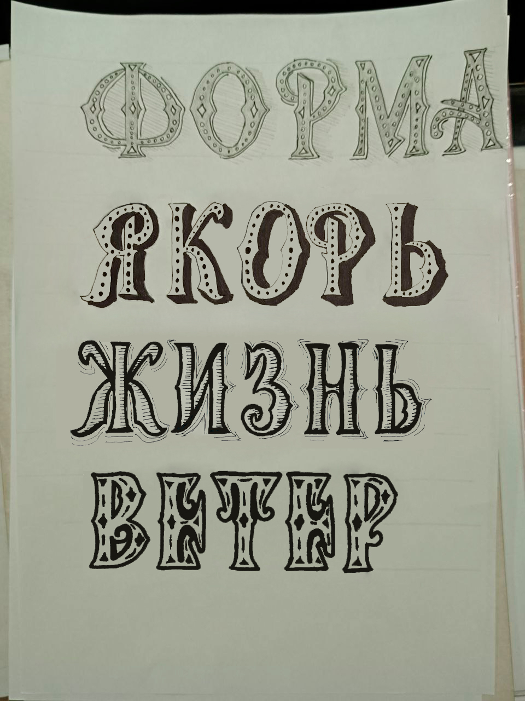
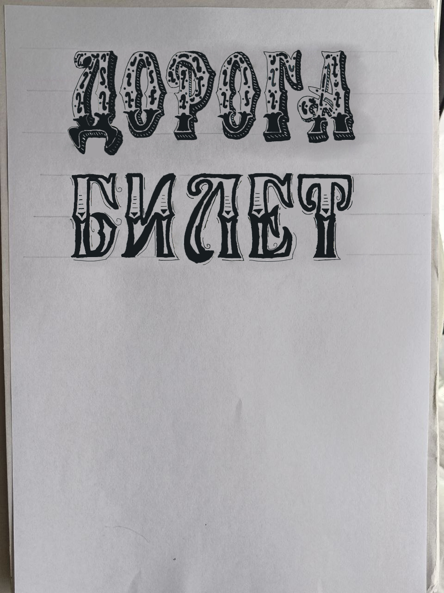
### Моё имя
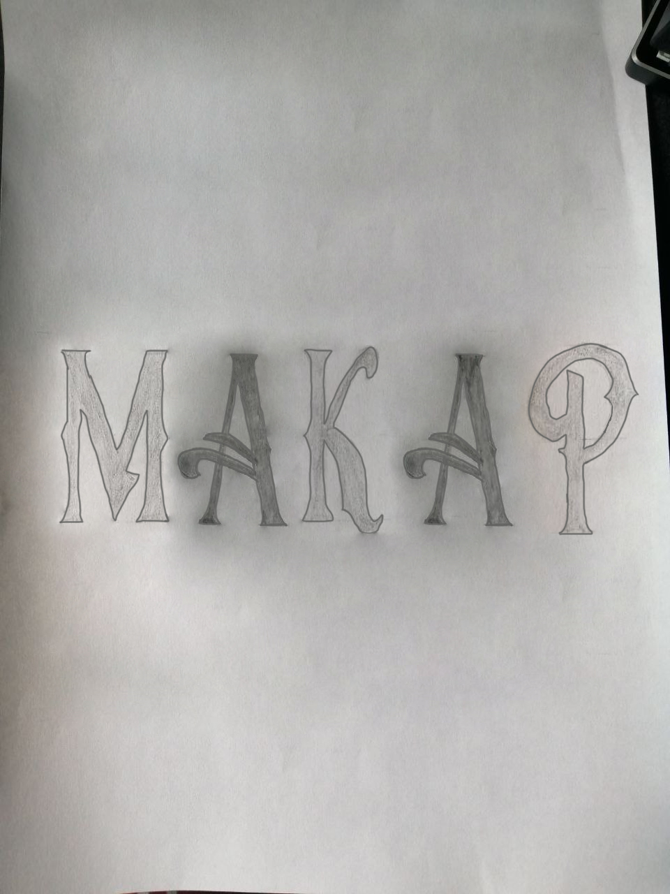
### Финальная композиция
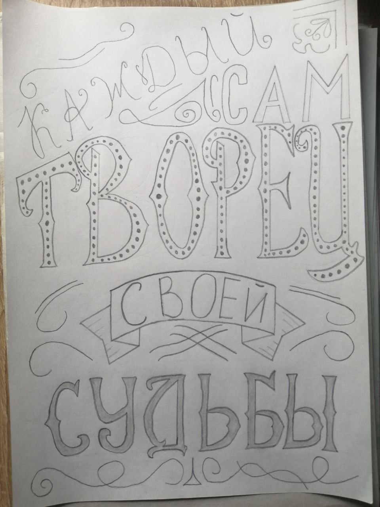