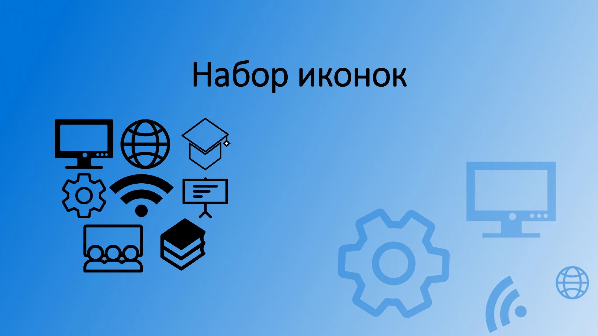
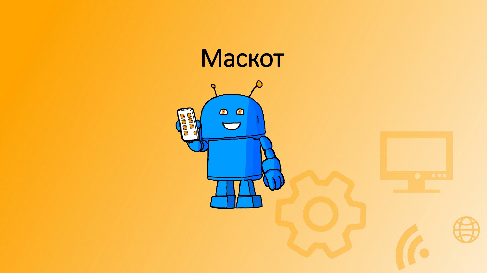
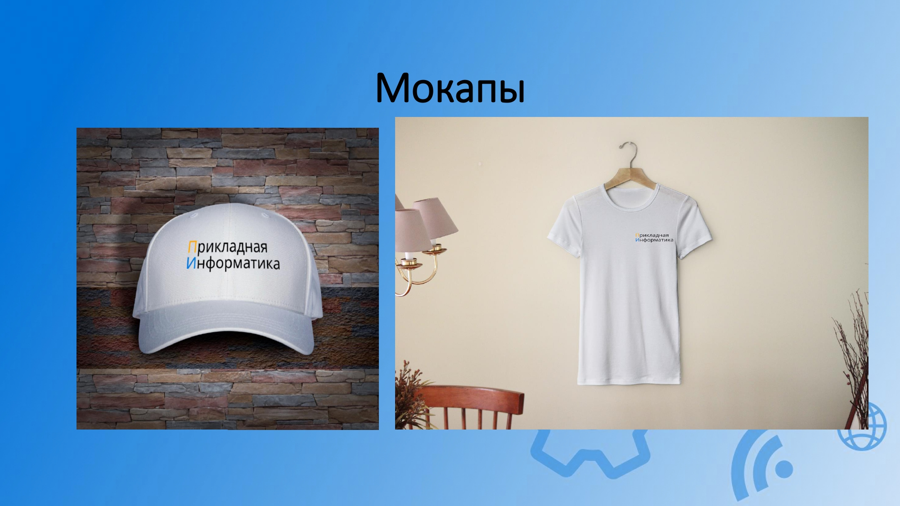
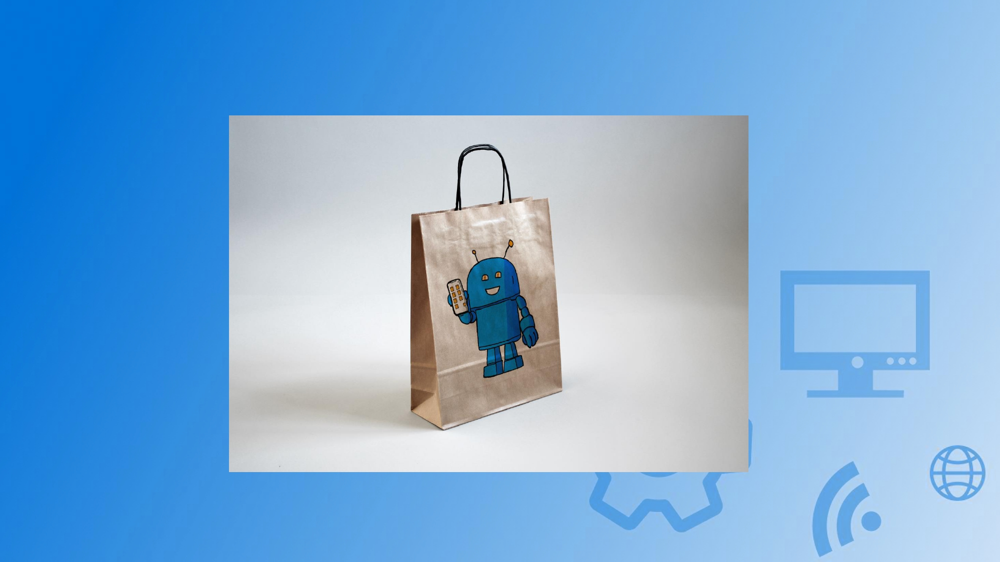
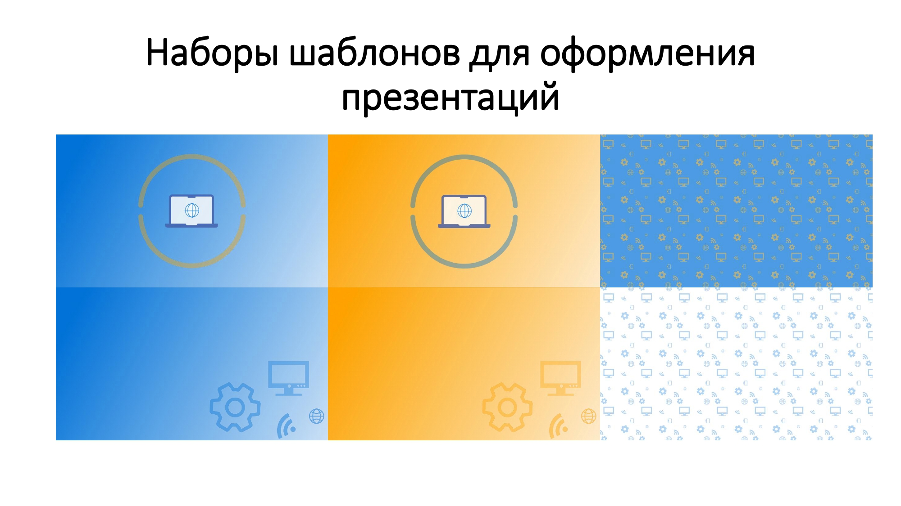
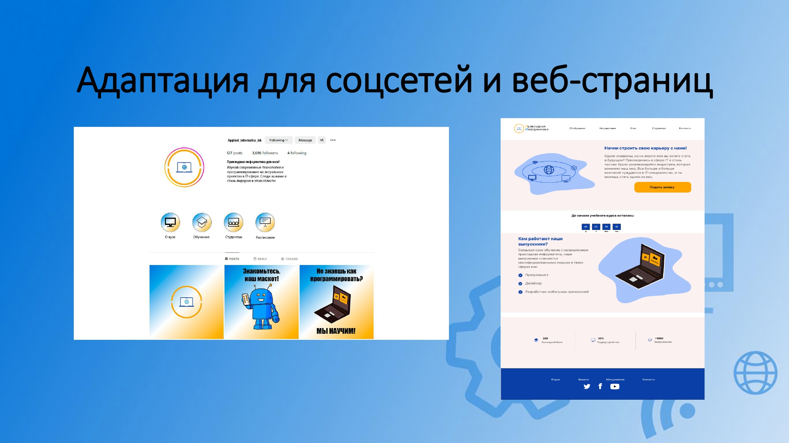

# Итоговая работа. Разработка набора айдентики для направления "Прикладная информатика"
### Работа выполнена совмеcтсно с [KARLL25](https://github.com/KARLL25)
## Ниже предоставлен брендбук проекта.

# Отдельные работы
## 1. Клеймо мастера
### Мастер оружейник(кузнец)

## 2. Фамильный герб
